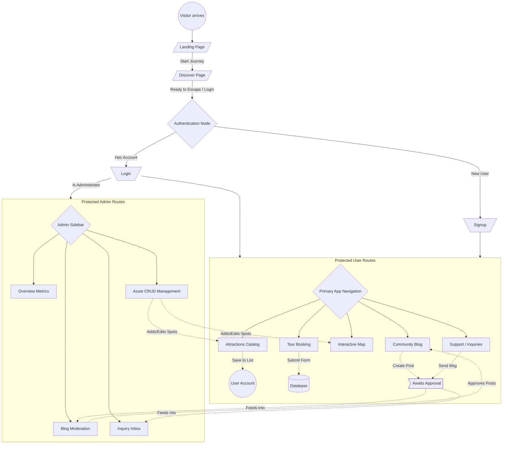

# Bulusan Tourism Platform Analysis Report

## 1. Detailed Overview of Pages

### Landing Page (`/`)
An immersive, high-end entry point that leverages a dark-mode, drone-shot aesthetic to captivate visitors. 
- **Hero Section**: Uses a full-screen background overlay with floating, high-impact typography. It introduces the "Nature's Best Kept Secret" tagline and hosts a robust Call-to-Action (CTA) button driving traffic directly to the `/discover` funnel.
- **Animations**: Driven entirely by `framer-motion`, featuring staggered fade-ins for text and micro-interactions on hover (scale and box-shadow shifts for the CTA).
- **Feature Grid**: A three-card layout highlighting "Smart Mapping", "Curated Discovery", and "Safe Exploration", utilizing modern icons and slight upward transitions when scrolled into view.
- **Experience Stats**: A dedicated bar highlighting engagement metrics (15+ Natural Wonders, 4.9/5 Ratings) to build social proof.

### Discover Page (`/discover`)
Designed to deliver general town information, cultural background, and historical context about Bulusan. It acts as an introductory bridge before throwing users into booking systems.

### Attractions Page (`/attractions`)
The core catalog for discovering tourist spots, nature parks, and dining options.
- **Search & Filter Controls**: Features a real-time text search bar and category filter pills (`All`, `Nature`, `Falls`, `Dining`, `Stay`) to instantly drill down the list.
- **Staggered Grid View**: Attractions are rendered as glassmorphic cards. Each displays a top-right overlaid rating badge, category label, thumbnail, and location. Users can save items to their trip by toggling a "Heart" icon.
- **Deep-Dive Modal Overlay**: Clicking any attraction card prevents a hard navigation and instead pulls up a sleek, frosted-glass Modal. This modal features:
  - A massive media gallery (capable of rendering `iframe` YouTube embeds or static imagery).
  - Rich description text.
  - A mapped section containing mock Community Reviews and Avatars.
  - A right-hand metadata sidebar showing Hours, Entrance Fees, and a mini-map placeholder.

### Tours Page (`/tours`)
The commercial heart of the platform designed to facilitate bookings.
- **Tour Grid**: Displays detailed tour packages that highlight duration, pax/group limits, scheduling, and package cost.
- **Booking Modal**: Clicking "Book Now" opens a sophisticated two-panel reservation form. The left panel shows the package summary and price over a gradient background. The right panel holds the form data (Name, Preferences, Guests, Contact info, Special Accommodations). 

### Interactive Map Page (`/map`)
A deeply integrated GIS feature utilizing `react-leaflet`.
- Plots key points of interest. 
- Intended to feature complex routing and wayfinding (`leaflet-routing-machine`) so tourists can understand distances between their hotels and the attractions.

### Blog Page (`/blog`)
A hybrid public-facing gallery and submission portal.
- Displays community-submitted stories and photos.
- Features an interactive "Submission Mode" where users can upload high-resolution images via a custom Drag-and-Drop system and write their narratives.

### Admin Portal (`/admin-portal`)
A highly privileged area wrapped in an `<AdminRoute>` boundary.
- **Sidebar Navigation**: Allows quick switching between multiple dashboards.
- **Overview Dashboard**: Displays real-time metrics (Total Visitors, Active Pins, Unread messages).
- **Assets CRUD Panel**: A tabular interface where admins can delete old listings, or spawn a rich modal to Add New Assets. The Asset Creation modal natively features a Leaflet map picker so admins can drop pins to record raw Coordinates, as well as file-upload areas for the asset's cover photo.
- **Blog Moderation Panel**: Admins can preview user-submitted blog posts and manually click "Approve" before they become visible to the public.
- **Inquiry Inbox Panel**: A split-screen email-like reader where contact requests are browsed on the left and read on the right.

### Authentication Flow & Account Pages (`/login`, `/signup`, `/account`)
Handles user onboarding, maintaining a personalized space for travelers to recall their favorited itineraries and account details.

---

## 2. User Journey & Application Flow

The application flow heavily relies on nested React Router paths to enforce security barriers and dictate the user journey.

### Story of the Data Flow
1. **The Hook (Public Zone)**: Users arrive and freely browse the Landing and Discover pages. These are totally un-authenticated routes.
2. **The Gateway (Auth Zone)**: Once they want to interact (book a tour, view the specific catalog, or write a blog), they must pass the `<UserRoute>` wrapper by logging in via Firebase (or Demo Mode). 
3. **The Core Loop (User Zone)**: Visitors explore `Attractions` and `Tours`. If they interact (like submitting a 'Contact Us' form or proposing a Blog post), that data is pushed up to the `dbService` backend and flagged as 'Pending' or 'New'.
4. **The Control Center (Admin Zone)**: High-level accounts (Admins) bypass the regular portal and enter the `<AdminRoute>`. Here, they pull down the newly generated user logs. For instance:
    - If an Admin *Creates an Asset* in their portal, that exact item immediately populates in the User's `Attractions` page and drops a new GPS pin on their `Map` page.
    - If an Admin *Approves a Blog*, it transitions its status so the overarching `<BlogPage>` queries pick it up, rendering it publicly.

---

## 3. Core Features & Capabilities Detailed

- **"Demo Mode" Local Storage Fallback Strategy**: 
  Instead of crashing if Firebase credentials fail or are omitted (a common issue in local dev environments), the backend hooks gracefully pivot to browser `localStorage`. Accounts can still be "created", signed in, and data (like new blogs or attractions) can be written and read seamlessly. 
- **Premium Glassmorphism & Micro-animations**: 
  The UI is standardized around heavily blured backgrounds (`backdrop-filter`) over soft colors, giving an iOS-like semi-transparent feel. Buttons gently scale up `scale(1.05)`, and lists render with a staggered timeline using Framer Motion's `staggerChildren`.
- **Drag-and-Drop Media Systems**:
  Implemented a custom `<FileUploader>` component that listens for `onDragOver` events, enabling frictionless dropping of photos and videos for blogs and asset management.
- **Role-Based Access Control Boundaries**: 
  The App Router leverages layout wrappers (`<PersistentLayout>`, `<UserRoute>`, `<AdminRoute>`). Certain routes throw immediate redirects if an unauthorized user attempts to infiltrate the `/admin-portal`.

---

## 4. Current Errors Breaking the Build

The platform fails to compile under strict TypeScript (`npx tsc --noEmit`) and lacks a linter setup:
1. **Map Component Type Rejection**: 
   `BulusanMap.tsx` supplies a `draggableWaypoints` property to `RoutingControlOptions`. The latest Type Definitions reject this property, causing a hard build failure.
2. **Theme Property Collision**: 
   `LandingPage.tsx` points to `props.theme.colors.bgLight`, but the actual Theme object likely uses `lightBg`, leading to an undefined CSS background and a TS Error.
3. **Missing Lint Script**:
   There is no `eslint` dependency wired up, meaning bad formatting and hidden errors are slipping through.

---

## 5. Wrong Structure, Messy Code, and Technical Debt

- **The "God Component" Anti-pattern**: 
  `AdminPortalPage.tsx` spans an unwieldy block of roughly 500 lines. It manages the Sidebar State, the complex Form State for new assets, the Blog Moderation tabular data, the Inbox messaging UI, Map initialization for coordinates, *and* the file uploading execution logic in a single file. It is virtually unmaintainable without breaking it apart.
- **Rampant Use of the `any` Type**: 
  While being a TypeScript project, the codebase frequently utilizes `any` for complex objects (`selectedTour`, `selectedInquiry`, Firestore collections). This causes the IDE to lose intelligent auto-complete and completely nullifies TypeScript's safety, allowing bugs to propagate secretly.
- **Abandoned Styled-Components Best Practices**: 
  The project embraces `styled-components` at the top level, but deeply nests inline styles throughout its JSX, e.g., `
`. This causes high specificity chaos and bloats the markup.
- **Hard-Coupled Business Logic**: 
  Database interaction logic (like `dbService.add('attractions', [...])`) is slapped directly inside `onClick` methods. This ties the UI irreversibly to the database structure.

---

## 6. Structured Improvement Plan

To bring the codebase to professional standards, the following roadmap is advised:

### Phase 1: Stability & Security
- Fix the `LandingPage.tsx` missing theme variable (`bgLight`).
- Resolve the Leaflet Routing Type Error in `BulusanMap.tsx`.
- Install `eslint` & related plugins, executing an auto-fix pass across the `/src` directory to normalize quotes and indentations.

### Phase 2: Strict Typing Implementations
- Create a `types/index.ts` declaring robust interfaces: `User`, `Review`, `LocationCoords`, `AttractionDTO`, `TourPackageDTO`.
- Sift through hooks (e.g. `useFirestore`) and Page Components to replace all `any` usages with the new interfaces.

### Phase 3: Component Atomization
- **Refactor `AdminPortalPage`**: Splice out `<OverviewPanel>`, `<BlogModerator>`, `<InboxReader>`, and `<AssetManager>` into their own file structures under `/components/Admin/`.
- Break monolithic files into clean, readable parent-child hierarchies.

### Phase 4: CSS Normalization
- Rip out all `style={{ ... }}` objects scattered within the JSX.
- Move these properties into their respected Styled Component definitions, ensuring theme variables (e.g., `props.theme.colors.darkBlue`) are universally respected.
